# IaC with Terraform: AWS Foundational Infrastructure and Remote Backend

**Objective:** Use Terraform to define and deploy foundational AWS infrastructure (VPC, subnet, IGW, security group, EC2) and configure a remote backend in Amazon S3 with DynamoDB state locking.

---

## 1. Tools and Environment

| Tool | Version |
|---|---|
| Terraform | v1.15.8 |
| AWS CLI | aws-cli/2.35.21 |
| OS | Windows + WSL2 (Ubuntu) |
| AWS Profile | `devops-lab` |

**Note on instance type:** the lab instructions specify `t2.micro`, but this AWS account's Free Tier eligibility only includes `t3.micro`, `t3.small`, `t4g.micro`, `t4g.small`, and a couple of compute-optimized types, not `t2.micro`. This was verified with `aws ec2 describe-instance-types --filters "Name=free-tier-eligible,Values=true"`. `t3.micro` was used instead as the nearest Free Tier eligible equivalent. See the screenshot below.

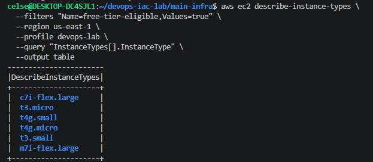

---

## 2. Architecture Overview

```
                         ┌─────────────────────────────┐
                         │           AWS VPC            │
                         │        10.0.0.0/16           │
                         │                               │
                         │   ┌───────────────────────┐   │
   Internet ───IGW───────┼──▶│   Public Subnet        │   │
                         │   │   10.0.1.0/24          │   │
                         │   │                        │   │
                         │   │   ┌────────────────┐   │   │
                         │   │   │  EC2 (t3.micro) │   │   │
                         │   │   │  Amazon Linux   │   │   │
                         │   │   │  2023           │   │   │
                         │   │   └────────────────┘   │   │
                         │   │   SG: 22 (my IP),       │   │
                         │   │       80 (0.0.0.0/0)    │   │
                         │   └───────────────────────┘   │
                         └─────────────────────────────┘

  Remote state backend (separate, persistent, reusable project):
  ┌────────────────────┐        ┌───────────────────────┐
  │   S3 Bucket          │◀─────▶│  DynamoDB Table        │
  │   (tfstate storage)  │       │  (state locking)       │
  └────────────────────┘        └───────────────────────┘
```

This project is split into two Terraform configurations:

- **`bootstrap/`**: creates the S3 bucket and DynamoDB table used as the remote backend. Uses local state, since it can't use itself as a backend (see the rationale below).
- **`main-infra/`**: creates the VPC, subnet, IGW, route table, security group, and EC2 instance. Uses the S3 and DynamoDB backend created by `bootstrap/`.

### Why two separate projects instead of one

Terraform's `backend` block is read during `terraform init`, before any resources are created, so a backend can't point at a bucket that doesn't exist yet. There are two ways to resolve this:

1. **Two folders (the approach used here).** Bootstrap creates the backend infrastructure with local state, and main-infra is configured to use that backend from its very first `init`. This keeps things cleanly separated, and destroying `main-infra` never risks touching the state storage resources themselves.
2. **Single folder, two-phase init.** Create everything locally first, then add the backend block and migrate state. This was not used because it couples the backend's lifecycle to the same state it stores. Destroying the project would also try to destroy the bucket and table its own state lives in.

---

## 3. Repository Structure

```
devops-iac-lab/
├── README.md
├── .gitignore
├── apply-output.txt          # full terraform apply log (main-infra)
├── destroy-output.txt        # full terraform destroy log (main-infra)
├── bootstrap/
│   ├── main.tf                # S3 bucket + DynamoDB table
│   ├── variables.tf
│   ├── outputs.tf
│   └── terraform.tfvars
├── main-infra/
│   ├── backend.tf              # S3 backend config
│   ├── main.tf                 # VPC, subnet, IGW, route table, SG, EC2, key pair
│   ├── variables.tf
│   ├── outputs.tf
│   └── terraform.tfvars
└── screenshots/
```

---

## 4. Phase 1: Backend Bootstrap (`bootstrap/`)

This phase creates the S3 bucket (versioned, encrypted, public access blocked) and the DynamoDB table (`LockID` partition key) that together handle state storage and locking.

### terraform init

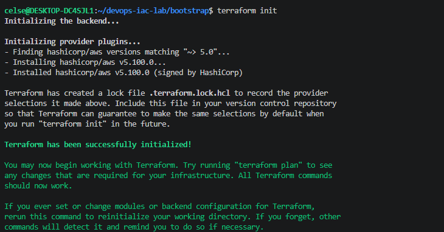

### terraform plan

Plan showed 5 resources to add: `aws_s3_bucket`, `aws_s3_bucket_versioning`, `aws_s3_bucket_server_side_encryption_configuration`, `aws_s3_bucket_public_access_block`, `aws_dynamodb_table`.

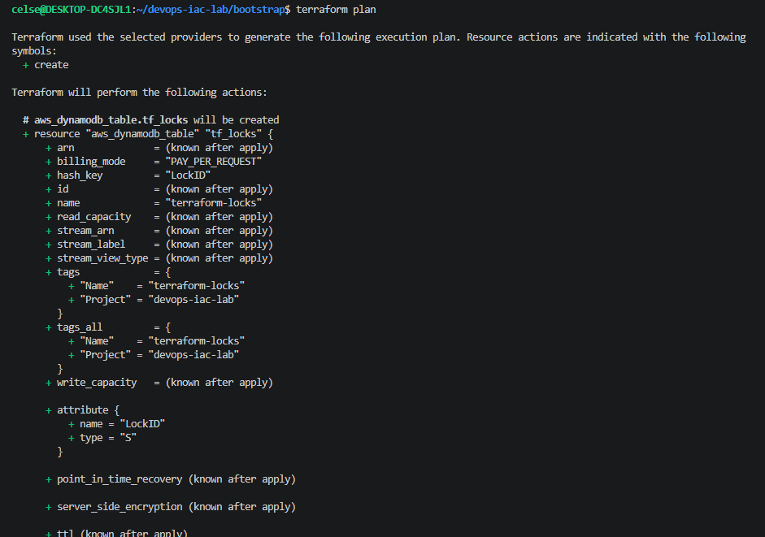

### terraform apply

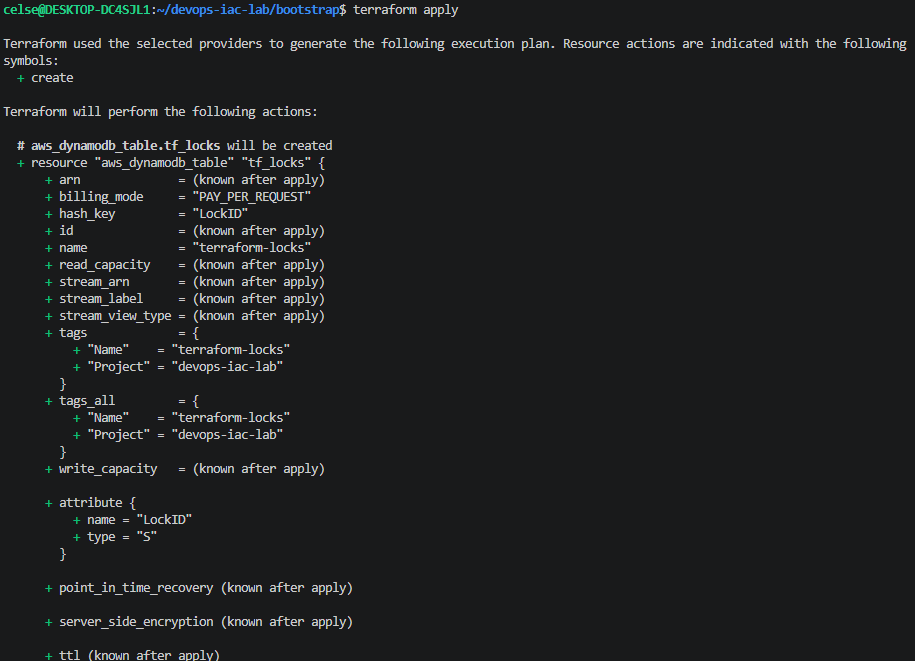

Result: **Apply complete! Resources: 5 added, 0 changed, 0 destroyed.**

### Outputs

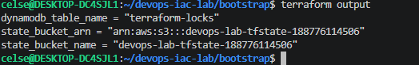

```
dynamodb_table_name = "terraform-locks"
state_bucket_arn    = "arn:aws:s3:::devops-lab-tfstate-188776114506"
state_bucket_name   = "devops-lab-tfstate-188776114506"
```

`bootstrap/` was not destroyed at the end of this lab. It's kept running so the remote backend persists and can be reused for future work. The cost is negligible, since S3 plus on-demand DynamoDB at this scale runs to fractions of a cent per month.

---

## 5. Phase 2: Main Infrastructure (`main-infra/`)

This project was configured from the start to use the S3 bucket and DynamoDB table from Phase 1 as its remote backend (see `backend.tf`).

### terraform init

The output confirms the backend connected successfully to S3.

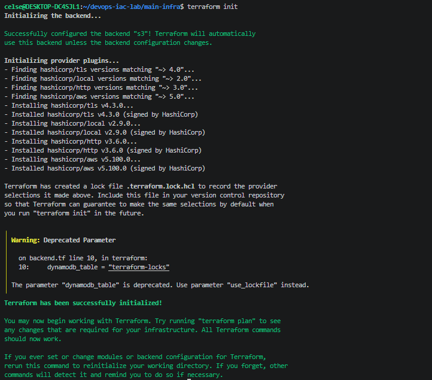

```
Successfully configured the backend "s3"! Terraform will automatically
use this backend unless the backend configuration changes.
```

### terraform plan

Plan showed 10 resources to add: VPC, subnet, IGW, route table, route table association, security group, key pair, generated private key file, TLS private key, and the EC2 instance. The plan also confirmed the security group's SSH rule was scoped to this machine's actual public IP, auto-detected via the `http` provider, rather than left open.

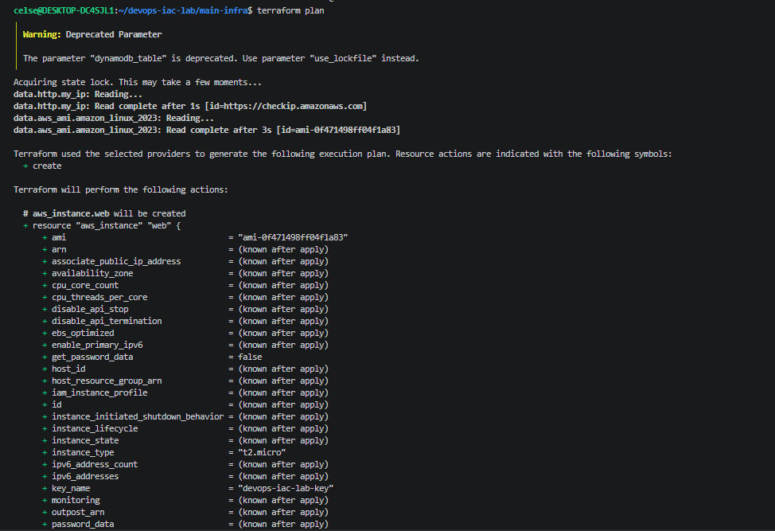

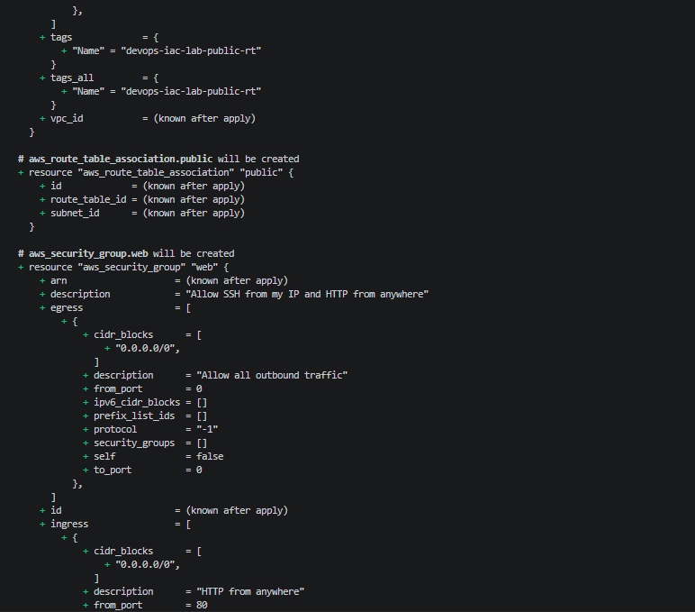

### terraform apply

The first attempt failed. AWS rejected `t2.micro` as not Free Tier eligible for this account:

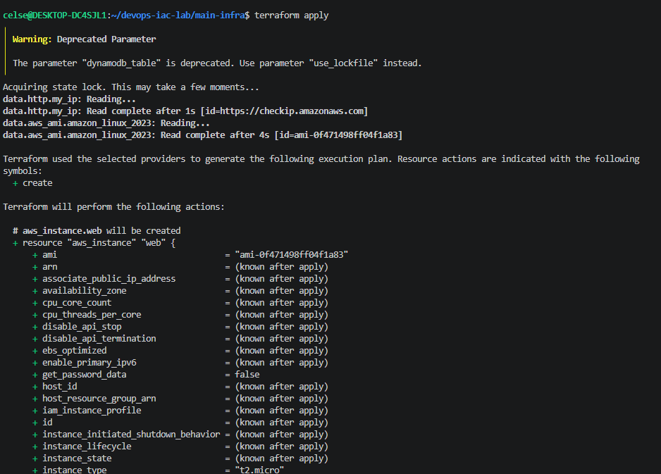

```
Error: creating EC2 Instance: ... InvalidParameterCombination:
The specified instance type is not eligible for Free Tier.
```

All other 9 resources (VPC, subnet, IGW, route table, association, security group, key pair, private key file) had already been created successfully before this error came up. `terraform.tfvars` was updated to `instance_type = "t3.micro"`, and `apply` was re-run. This time only the missing EC2 instance needed to be created.

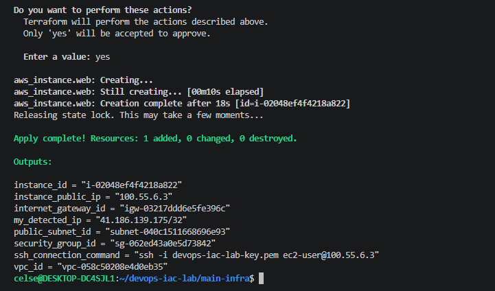

Result: **Apply complete! Resources: 10 added, 0 changed, 0 destroyed** (across the two apply runs combined).

Full apply log: [`apply-output.txt`](apply-output.txt)

### Outputs

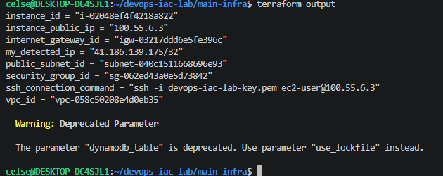

```
instance_id            = "i-02048ef4f4218a822"
instance_public_ip     = "100.55.6.3"
internet_gateway_id    = "igw-03217ddd6e5fe396c"
my_detected_ip         = "41.186.139.175/32"
public_subnet_id       = "subnet-040c1511668696e93"
security_group_id      = "sg-062ed43a0e5d73842"
ssh_connection_command = "ssh -i devops-iac-lab-key.pem ec2-user@100.55.6.3"
vpc_id                 = "vpc-058c50208e4d0eb35"
```

---

## 6. Verification

### SSH connectivity

This confirms the full network path (VPC, subnet, IGW, route table, security group) actually works, not just that the resources exist.

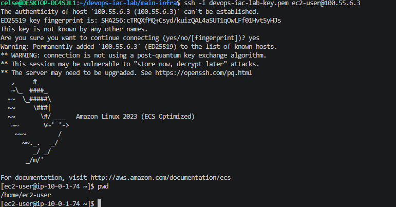

### AWS Console: Resources

| Resource | Screenshot |
|---|---|
| VPC | 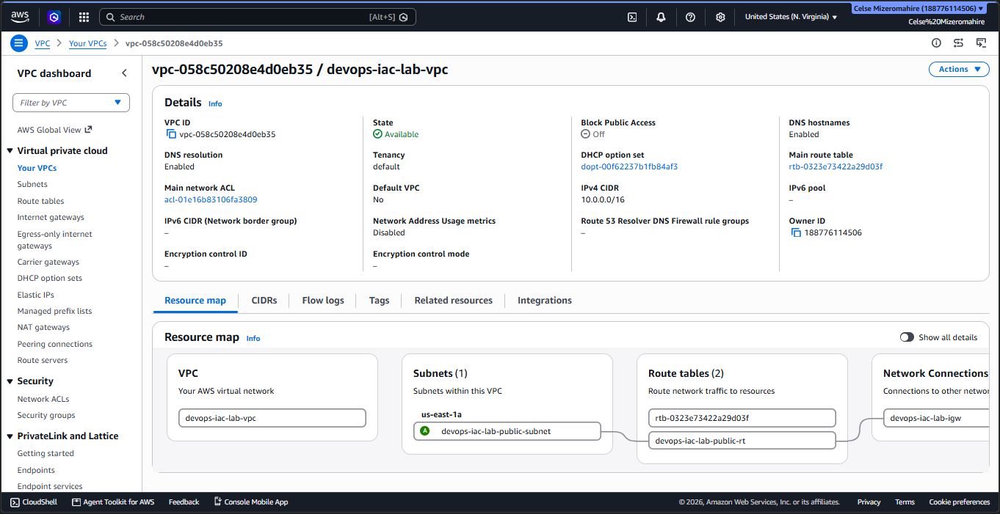 |
| Public Subnet | 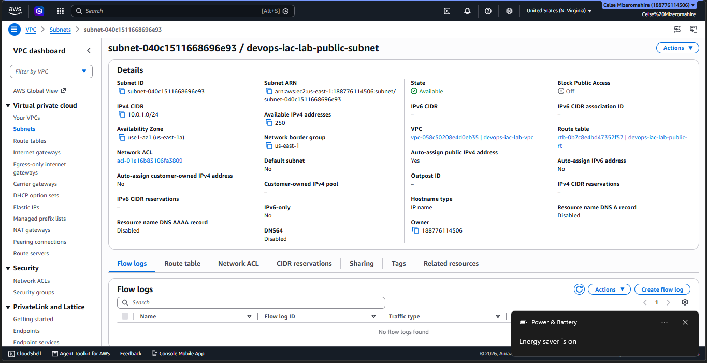 |
| Internet Gateway | 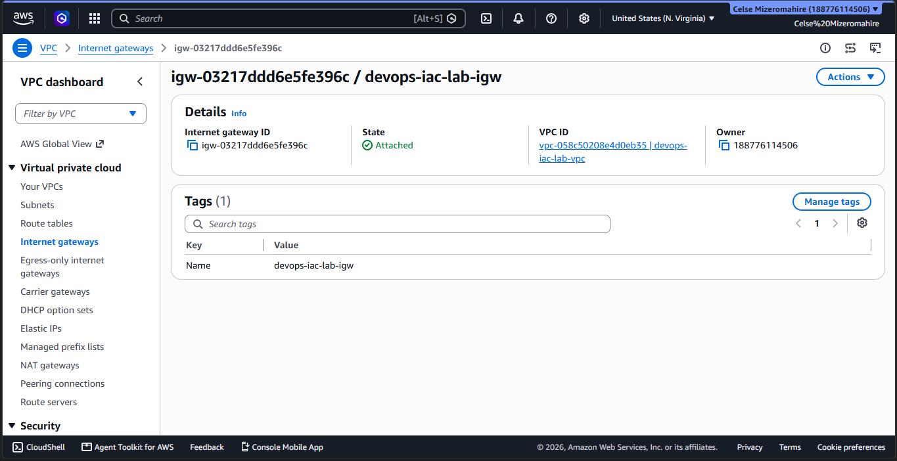 |
| Route Table | 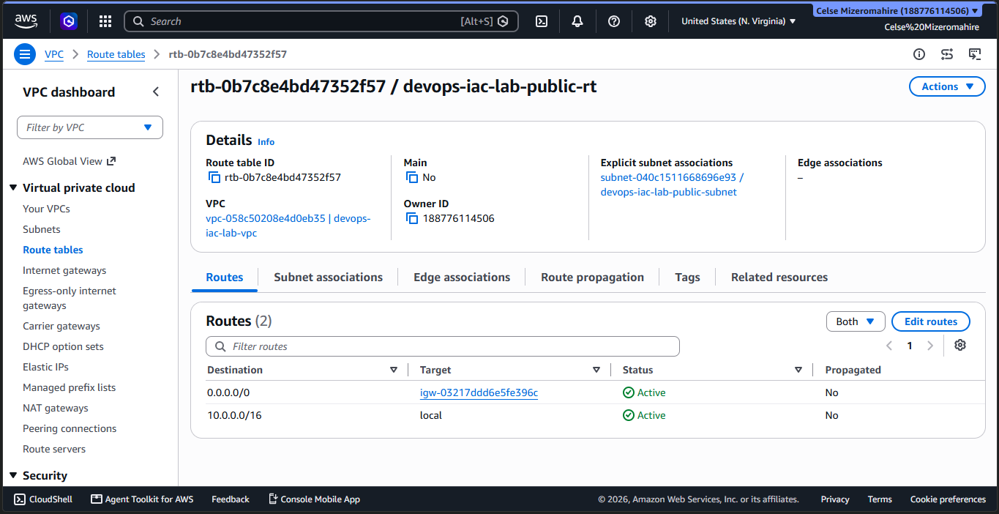 |
| Security Group | 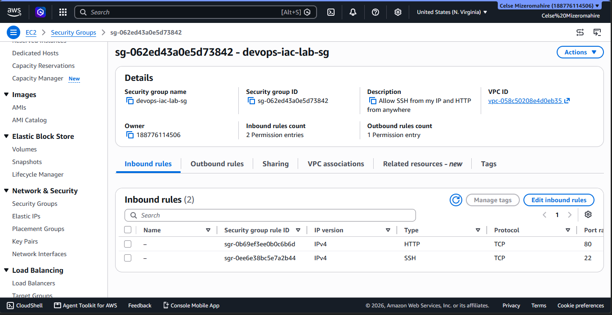 |
| EC2 Instance | 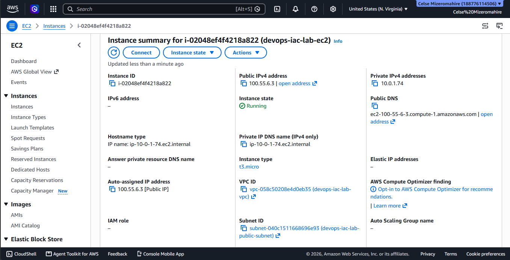 |

### AWS Console: Remote Backend Proof

| Resource | Screenshot |
|---|---|
| S3 bucket (state storage) | 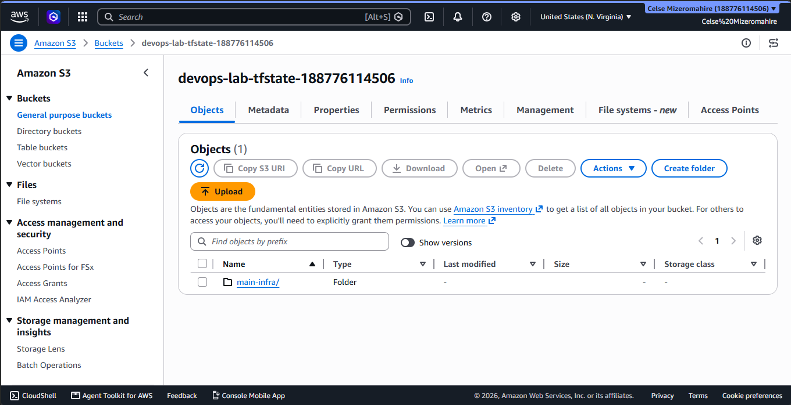 |
| DynamoDB table (state lock) | 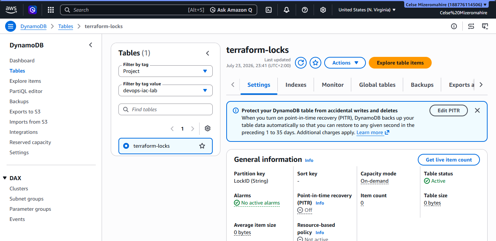 |

---

## 7. Cleanup: terraform destroy

This destroy was run against `main-infra/` only. `bootstrap/` (S3 and DynamoDB) was intentionally left in place; see the Phase 1 notes above.

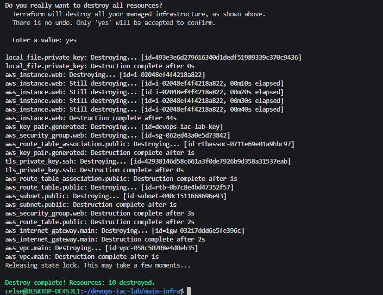

```
Destroy complete! Resources: 10 destroyed.
```

Full destroy log: [`destroy-output.txt`](destroy-output.txt)

---

## 8. How to Reproduce

```bash
# Phase 1: bootstrap the remote backend
cd bootstrap
export AWS_PROFILE=devops-lab
terraform init
terraform plan
terraform apply

# Phase 2: main infrastructure (uses the backend created above)
cd ../main-infra
terraform init
terraform plan
terraform apply

# SSH in (uses the auto-generated key pair)
chmod 400 devops-iac-lab-key.pem
ssh -i devops-iac-lab-key.pem ec2-user@<instance_public_ip>

# Tear down main infra when done
terraform destroy
```